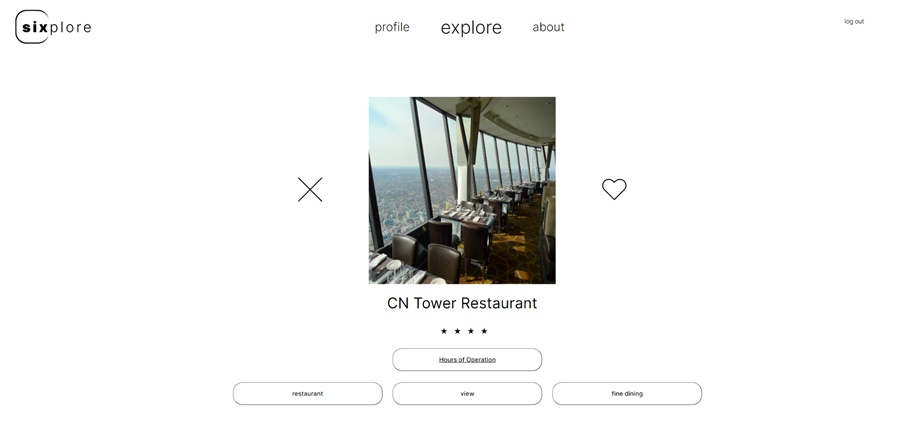
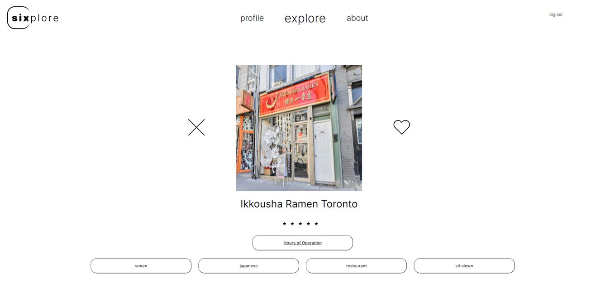
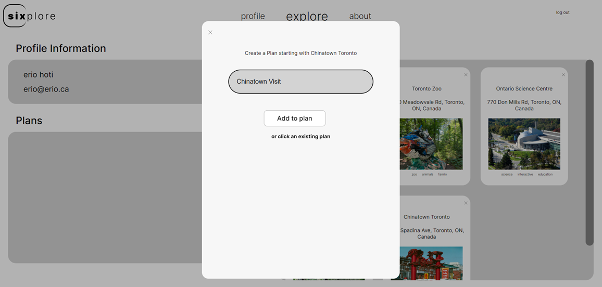
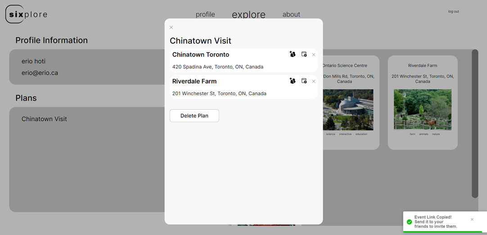
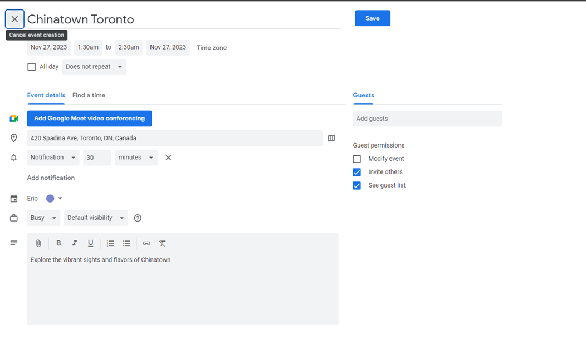

import { FaReact } from "react-icons/fa";
import { SiJavascript, SiMongodb } from "react-icons/si";

export function Technologies() {
  return (
    

      <FaReact className="w-6 h-6" />
      <SiJavascript  className="w-6 h-6"/>
      <SiMongodb className="w-6 h-6"/>
    
    
  )
}

<Technologies />

## Discover the 6ix
A dating app … for Toronto experiences and destinations. Our app transforms urban exploration into a captivating adventure! Users can open up their phone, access our app, and swipe through an endless curated selection of unique and hidden locations, from local gems to iconic landmarks and ongoing events across Toronto.

## App features
Users can
- Like or Dislike Events.

- Create plans.

- View events.

- Add others through google calendar.

This was a group project done during my Project Management Course where we utilized Scrum methodologies, 
such as sprints to develop project documentation as well as the product itself.

